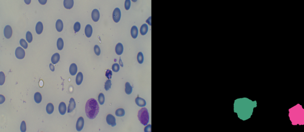
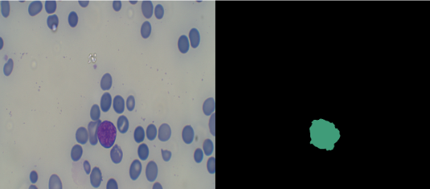

Hemato Dataset Link "https://warwick.ac.uk/fac/cross_fac/tia/data/nuclick/"
AttriDet(Leukemia) dataset "https://drive.google.com/drive/folders/1J5ld-tK6cewj9wXWUi3rs6UdlHnDBe8U?usp=sharing"

Training Script:python tools/train.py configs/segformer/B1/segformer.b1.512x512.hemato.160k.py  work_dirs/hemato_binary

Testing Script:python tools/test.py configs/segformer/B1/segformer.b1.512x512.hemato.160k.py work_dirs/hemato_binary/latest.pth

Inference Script:python tools/hemato_inference.py configs/path to this file local_configs/segformer/B1/segformer.b1.512x512.hemato.160k.py   work_dirs/hemato_binary/latest.pth

Results
+------------+-------+-------+
| Class      | IoU   | Acc   |
+------------+-------+-------+

| Background | 98.48 | 98.62 |
| WBC        | 97.43 | 99.55 

+------------+-------+-------+

These are segmented images of Leukemia dataset

